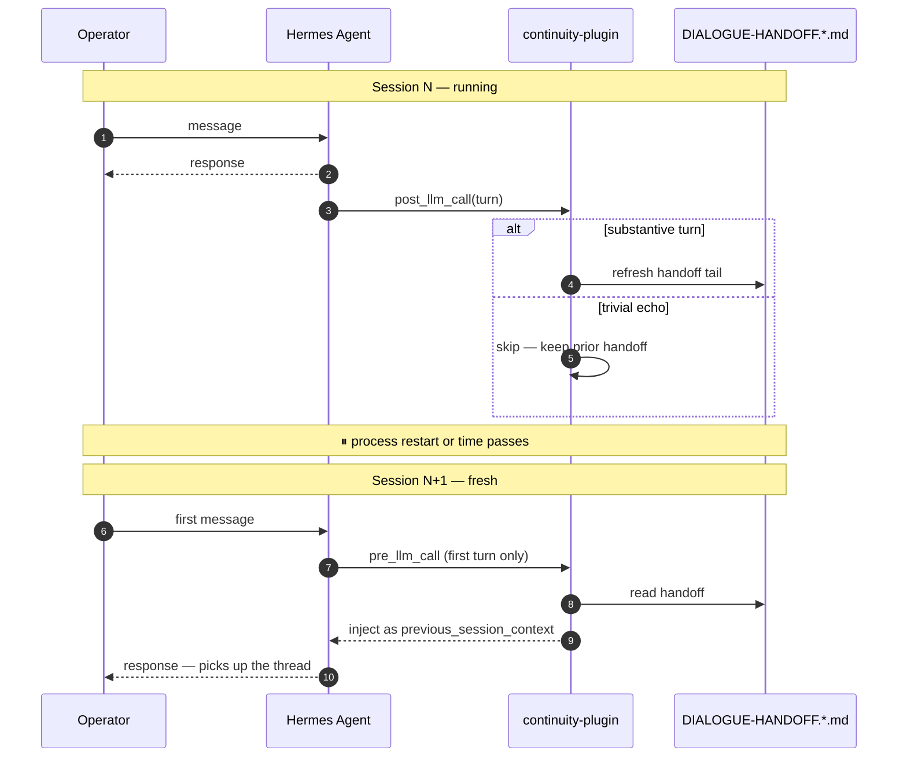

# hermes-continuity-plugin

Working memory for Hermes Agent.

[](https://github.com/Mar-IA-no/hermes-continuity-plugin/releases)
[](LICENSE)
[](https://github.com/NousResearch/hermes-agent)

This plugin exists for the moment right after an interruption, when the model wakes up again and the operator assumes continuity, but the process itself has no lived sense of “where we were”.

That is the hole this repo fills.

It does not try to be a database.
It does not try to be a retrieval engine.
It does not try to summarize your whole life.

It does one narrower thing:

> it preserves the immediate conversational thread well enough that a fresh session can continue like it actually has a past.

And it does that in a way that works not only for one chat window, but for agents that live across multiple channels:

- CLI
- Telegram
- Discord
- Minecraft
- or anything else that shows up as a Hermes `platform`

---

## Table of Contents

- [What This Plugin Is For](#what-this-plugin-is-for)
- [What It Does Today](#what-it-does-today)
- [Working Memory vs Long-Term Memory](#working-memory-vs-long-term-memory)
- [Install](#install)
- [Configuration Modes](#configuration-modes)
- [How Per-Platform Handoff Works](#how-per-platform-handoff-works)
- [The `HERMES_PLATFORM` Override](#the-hermes_platform-override)
- [Legacy Fallback for Upgrades](#legacy-fallback-for-upgrades)
- [How the Hooks Behave](#how-the-hooks-behave)
- [Tunables](#tunables)
- [What Gets Written to Disk](#what-gets-written-to-disk)
- [Compatibility](#compatibility)
- [What This Plugin Does Not Try to Do](#what-this-plugin-does-not-try-to-do)
- [Related Repos](#related-repos)
- [Repo Map](#repo-map)
- [Contributing](#contributing)
- [License](#license)

---

## What This Plugin Is For

Most agents lose continuity in a very ordinary way:

- the process restarts;
- the session is fresh;
- the JSON history is still somewhere on disk;
- but the model does not have the thread in front of it anymore.

So the first message of a new session becomes awkward:

- “what were we doing?”
- “can you remind me?”
- “continue”

And the agent either:

- answers vaguely,
- reconstructs context too slowly,
- or reloads too much and contaminates the prompt.

This plugin is the anti-amnesia layer between those extremes.

---

## What It Does Today

On the current main branch, the plugin does four important things:

### 1. Persists only substantive turns

If a turn is too trivial, it does not overwrite the good handoff.

### 2. Preserves multi-line responses

Markdown, lists, tables, and structured answers are no longer mangled into first-line stubs.

### 3. Stores a rolling tail of recent exchanges

It keeps the last few meaningful turns in a form ready to inject directly, without reopening and reconstructing full session JSON every time.

### 4. Separates working memory by platform

CLI and Minecraft do not need to step on each other.
Telegram and Discord do not need to share a handoff just because they belong to the same agent identity.

That is the big shift of the `v1.1.x` line.

---

## Working Memory vs Long-Term Memory

This repo is **working memory**.

That means:

- recent thread,
- re-entry continuity,
- short conversational arc,
- immediate “pick up where we left off”.

It is **not** long-term memory.

Long-term memory lives better in a separate system:

- durable canon,
- embeddings,
- hybrid retrieval,
- curated facts,
- plans,
- evidence.

That is why this plugin was split out from the memory kit.

Use this repo when the problem is:

> “how does the agent return to the conversation without acting like it has never been here?”

Use `hermes-memory-kit` when the problem is:

> “how does the agent store and retrieve durable knowledge over time?”

---

## Install

### Quick start: standalone defaults

```bash
git clone https://github.com/Mar-IA-no/hermes-continuity-plugin
cd hermes-continuity-plugin
export HERMES_HOME=~/.hermes/hermes-home
./install.sh
```

That will:

- copy the plugin into `$HERMES_HOME/plugins/dialogue-handoff/`;
- create default state directories if needed;
- and print the env vars you should export in your shell or save in your Hermes `.env`.

### If you use `hermes-memory-kit`

You usually do **not** need `install.sh`.

The kit already vendors this plugin and installs it into bootstrapped workspaces with the expected paths.

---

## Configuration Modes

The installer supports four modes.

| Mode | What you provide | What happens |
|---|---|---|
| `kit-integrated` | nothing manually; handled by the kit | paths resolve into the workspace layout |
| `bases` | `HERMES_HOME`, `HERMES_AGENT_MEMORY_BASE` | state files are derived from the base directory |
| `direct` | `HERMES_HOME` + the three direct paths | the plugin writes exactly where you tell it |
| `standalone defaults` | `HERMES_HOME` only | state goes under `~/.hermes-continuity-plugin-data/` |

The plugin needs two things:

1. where Hermes lives (`HERMES_HOME`);
2. where continuity state should be written.

It can discover the second either from:

- direct paths, or
- a base directory.

### Supported env cascade

Direct paths:

```text
HERMES_HANDOFF_PATH         || HMK_DIALOGUE_HANDOFF_PATH
HERMES_ALWAYS_CONTEXT_PATH  || HMK_ALWAYS_CONTEXT_PATH
HERMES_SESSIONS_DIR         || HMK_SESSIONS_DIR
```

Bases:

```text
HERMES_AGENT_MEMORY_BASE    || AGENT_MEMORY_BASE / HMK_AGENT_MEMORY_BASE / HMK_BASE_DIR
HERMES_HOME                 || HMK_HERMES_HOME
```

If the plugin has to use a legacy variable, it logs a `logger.warning()` once per matched var.

---

## How Per-Platform Handoff Works

The plugin no longer has to treat all channels as one undifferentiated stream.

The current behavior is:

- empty platform → legacy/base handoff file
- `cli` → legacy/base handoff file
- any non-CLI platform → suffixed handoff file

Examples:

```text
DIALOGUE-HANDOFF.md
DIALOGUE-HANDOFF.telegram.md
DIALOGUE-HANDOFF.discord.md
DIALOGUE-HANDOFF.minecraft.md
```

That means:

- a CLI session can continue naturally from prior CLI work;
- a Minecraft loop can keep its own embodied thread;
- a Telegram conversation does not inherit the wrong recent arc just because it is the same agent identity.

This is the difference between “same mind, multiple channels” and “one giant continuity soup”.

### Important nuance

The plugin derives per-platform files from the **already resolved handoff path**.

That matters because it keeps all install modes working:

- kit-integrated
- base-derived
- direct-path-only
- standalone defaults

It does **not** assume a specific workspace layout just to support platform separation.

---

## The `HERMES_PLATFORM` Override

Some host runtimes pass `platform` cleanly into plugin hooks.
Some do not.
Some wrappers hardcode `platform="cli"` even when you are really using the same agent process in another role.

That is why the plugin supports:

```text
HERMES_PLATFORM
```

Current behavior:

- if the hook passes a meaningful non-CLI platform, that wins;
- if the hook passes nothing, the plugin can fall back to `HERMES_PLATFORM`;
- if the hook passes literal `cli`, that value is treated as replaceable by `HERMES_PLATFORM`.

That last detail is what makes wrappers such as `hermes chat -q` usable in multi-platform setups.

Example:

```bash
HERMES_PLATFORM=minecraft hermes chat -q "what just happened?"
```

With the current plugin line, that can write to and read from:

```text
DIALOGUE-HANDOFF.minecraft.md
```

instead of contaminating the generic CLI handoff.

---

## Legacy Fallback for Upgrades

There is one upgrade problem worth solving gracefully:

You already had continuity in the legacy file.
Then you turn on per-platform handoff.
Now the platform-specific file does not exist yet.

Should the first turn of that platform see the old handoff or not?

That is controlled by:

```text
HERMES_HANDOFF_FALLBACK_LEGACY=true|false
```

Default:

```text
false
```

Meaning:

- strict isolation by default;
- opt-in fallback when you want upgrade-in-place convenience.

This is useful if you are migrating a live deploy and want the first non-CLI platform turn to still inherit the previous legacy continuity once.

---

## How the Hooks Behave

The plugin runs on two hooks of the Hermes plugin loader. The whole continuity cycle compresses to this:



### `post_llm_call`

After a successful assistant response:

- if the turn is substantive,
- the plugin updates the relevant handoff file,
- refreshes the `## Recent Exchanges` tail,
- and records the most recent useful conversational arc.

### `pre_llm_call`

On the first turn of a fresh session:

- the plugin reads the relevant handoff file,
- builds `<previous_session_context>`,
- and injects it into the user message.

That means the model does **not** need to reconstruct continuity by reopening arbitrary session logs every time.

The recent-exchanges block is the primary source of continuity.
Older handoff formats still have a legacy fallback path for backward compatibility.

---

## Tunables

At the top of `plugin/__init__.py` you will find:

```python
_SUBSTANTIVE_MIN_CHARS = 300
_TAIL_EXCHANGES = 4
_TAIL_CHARS_PER_MSG = 2000
```

In plain language:

- below the threshold, a turn is too trivial to deserve the handoff;
- only the most recent few substantive exchanges are kept;
- each message is capped to avoid runaway prompt growth.

These are not sacred values.
They are defaults chosen to trade continuity against prompt bloat.

---

## What Gets Written to Disk

The plugin works with three kinds of files:

### 1. Handoff files

Examples:

```text
DIALOGUE-HANDOFF.md
DIALOGUE-HANDOFF.telegram.md
DIALOGUE-HANDOFF.minecraft.md
```

These hold:

- last-turn metadata,
- working set hints,
- resume hint,
- and the `## Recent Exchanges` tail.

### 2. Always-context

```text
ALWAYS-CONTEXT.md
```

This is the stable reminder layer:

- operator rules,
- durable capability reminders,
- and “don’t forget this exists” notes.

### 3. Session history

The plugin may still consult session files for older compatibility paths, but the current continuity flow is intentionally driven by the handoff file itself.

---

## Compatibility

- Hermes Agent: `v0.10+`
- `hermes-memory-kit`: fully compatible when vendored from the current line
- Standalone use: supported, as long as the hook contract and env paths are available

If you run an older or modified Hermes runtime, verify:

- `pre_llm_call`
- `post_llm_call`
- and `platform` propagation

before trusting multi-channel continuity behavior.

---

## What This Plugin Does Not Try to Do

This plugin does **not** try to be:

- a long-term memory store;
- a vector database;
- a planner;
- a summarization engine for your whole history;
- or a magical recovery layer that fixes bad retrieval architecture.

It is deliberately narrower than that.

Its job is to make a fresh session feel less like amnesia and more like a continuation.

---

## Related Repos

- [hermes-memory-kit](https://github.com/Mar-IA-no/hermes-memory-kit) — durable memory, retrieval, scaffold, operational layout
- [Hermes Agent](https://github.com/NousResearch/hermes-agent) — upstream agent runtime

Additional docs in this repo:

- [`docs/dialogue-handoff.md`](./docs/dialogue-handoff.md)
- [`docs/architecture.md`](./docs/architecture.md)

---

## Repo Map

| Path | Role |
|---|---|
| `plugin/__init__.py` | hook implementation (`post_llm_call`, `pre_llm_call`) |
| `plugin/plugin.yaml` | manifest declaring hooks for Hermes' plugin loader |
| `templates/` | example continuity files (`ALWAYS-CONTEXT.plugin.md`, `DIALOGUE-HANDOFF.md`) |
| `tests/` | pytest suite — substantive gate, multi-line preservation, per-platform, env cascade |
| `install.sh` | standalone installer for users not using `hermes-memory-kit` |
| `docs/` | deeper notes on dialogue handoff and architecture |

---

## Contributing

Issues and PRs are welcome.

The bar for changes here is narrow on purpose:

- does it preserve the conversational thread better across interruption?
- does it keep working memory cleanly separated from long-term memory?
- does it avoid contaminating one platform's continuity with another's?
- does it keep the on-disk format inspectable by hand?

If you change the hook contract or the persistence format, run the test
suite and verify the behavior in a real Hermes workspace before opening
a PR.

---

## License

[MIT](LICENSE)
